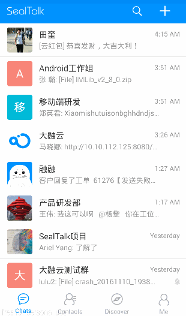
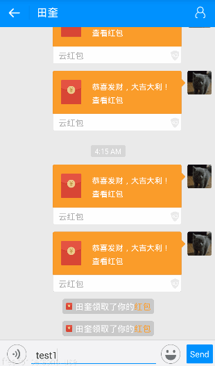
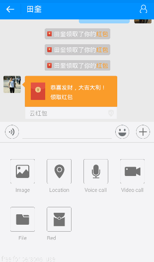
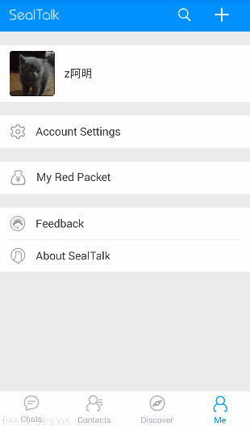
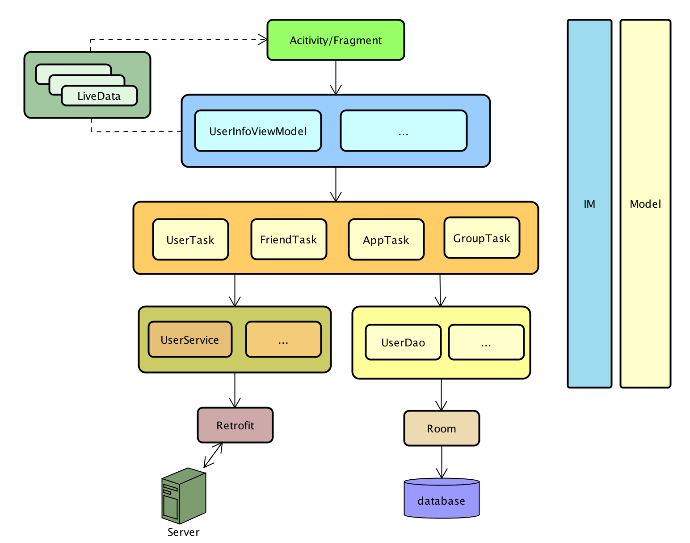
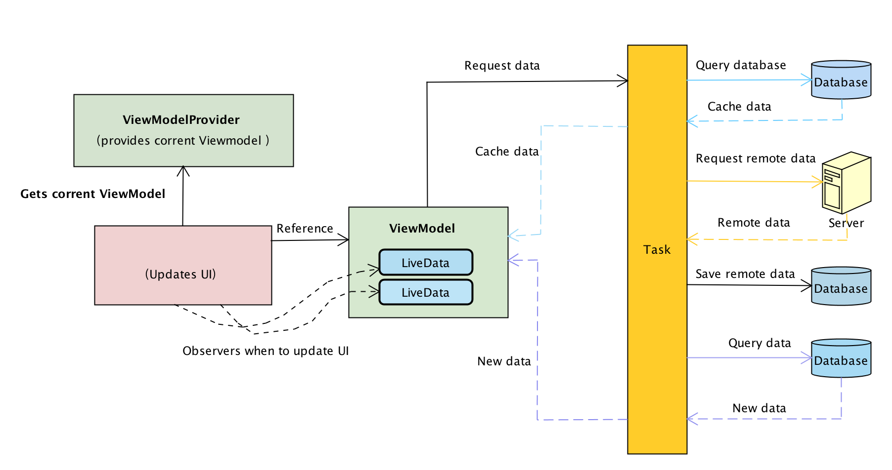
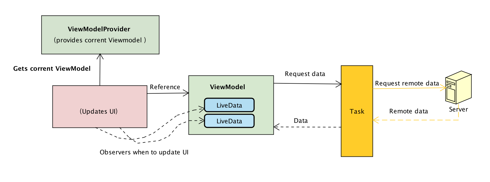
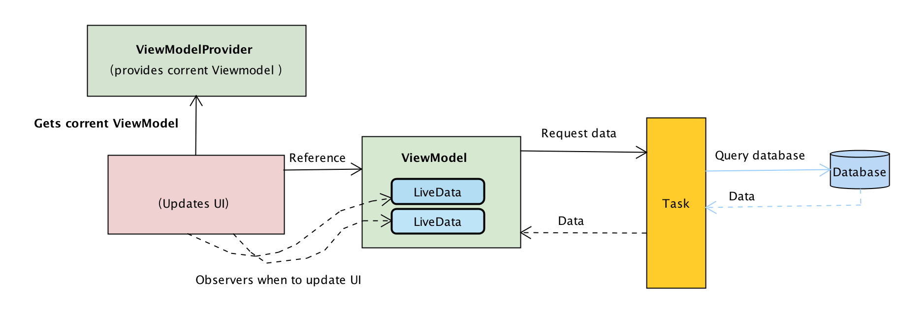

# SealTalk-Android
Android 应用 SealTalk 由 融云 RongCloud 出品。

## 特别注意
SealTalk 自从 1.3.14 版本起，CallLib 模块引用的音视频引擎已替换成 RTC 3.0，与之前的版本不互通。详细内容请参考官网的

## 特点  
* Android iOS [Web](http://web.sealtalk.im/) 多端互通,如果需要你的产品也可以这样实现。
* [音视频通话](http://www.rongcloud.cn/docs/android_callkit.html) 功能
* 地理位置,位置共享功能。
* 随心的 [消息自定义](http://www.rongcloud.cn/docs/android.html#%E6%B6%88%E6%81%AF%E8%87%AA%E5%AE%9A%E4%B9%89) , [功能模块自定义](http://www.rongcloud.cn/docs/android.html#4%E3%80%81%E4%BC%9A%E8%AF%9D%E6%89%A9%E5%B1%95%E5%8A%9F%E8%83%BD%E8%87%AA%E5%AE%9A%E4%B9%89)。
* 完整的好友体系代码示例。
* 完整的群组功能代码示例。
* 单聊,群组,聊天室多种社交场景满足你的需求,如果还想要 [视频直播](http://rongcloud.cn/live) 都可以。
* 一行代码搞定 [客服](http://rongcloud.cn/customservice)? 你没有听错,比你想象的还要简单。

## 运行 SealTalk-Android
1.  替换 SealTalkUrl.java 中的 DOMAIN 常量值为您所部署的 SealTalk 服务地址。  
```
public class SealTalkUrl {
    public static final String DOMAIN = 这里请替换为您所部署的 SealTalk Server 地址;
```
2. 替换 IMManager.java 中，init 方法中调用融云初始化的代码 RongIM.init 替换为您所申请的融云 AppKey。  
```
    private void initRongIM(Context context) {
        ...
        
        // 可在初始 SDK 时直接带入融云 IM 申请的APP KEY
        RongIM.init(context, 这里请替换为您的融云 AppKey, true);
```
3. 若使用第三方推送，请参考 IMManager.java 中 initPush 方法，打开注释并替换成您申请的各平台的推送信息
```
    /**
     * 初始化推送
     */
    private void initPush() {
        /*
         * 配置 融云 IM 消息推送
         * 根据需求配置各个平台的推送
         * 配置推送需要在初始化 融云 SDK 之前
         */
        //PushConfig config = new PushConfig
        //        .Builder()
        //        .enableHWPush(true)        // 在 AndroidManifest.xml 中搜索 com.huawei.hms.client.appid 进行设置
        //        .enableMiPush("替换为您的小米推送 AppId", "替换为您的小米推送 AppKey")
        //        .enableMeiZuPush("替换为您的魅族推送 AppId", "替换为您的魅族推送 AppKey")
        //        .enableVivoPush(true)     // 在 AndroidManifest.xml 中搜索 com.vivo.push.api_key 和 com.vivo.push.app_id 进行设置
        //        .enableFCM(true)          // 打开 build.gradle 和 AndroidManifest.xml 中的相关注释，并在 google-services.json 文件中进行配置
        //        .build();
        //RongPushClient.setPushConfig(config);
    }
```
若您要接入 FCM 推送，需要做以下几步工作:
* 打开 AndroidManifest.xml 解除掉以下注释。
```
<!-- [START firebase_service] -->
        <!--
        <service
            android:name="io.rong.push.platform.google.RongFirebaseMessagingService"
            android:stopWithTask="false">
            <intent-filter>
                <action android:name="com.google.firebase.MESSAGING_EVENT" />
            </intent-filter>
        </service>
        <meta-data
            android:name="firebase_messaging_auto_init_enabled"
            android:value="false" />
        <meta-data
            android:name="firebase_analytics_collection_enabled"
            android:value="false" />
         -->
        <!-- [END firebase_service] -->
```
* 在 build.gradle 中解除以下注释
```
//apply plugin: 'com.google.gms.google-services'
... 
//api 'com.google.firebase:firebase-messaging:17.6.0'
...
* 
```
* 编译 google-services.json 配置为您的 FCM 推送相关配置参数  
4. 若使用地图相关功能，在 AndroidManifest.xml 中搜索 com.amap.api.v2.apikey 修改为您的高德地图 ApiKey
```
<!-- 高德地图-->
        <!--
        <meta-data
            android:name="com.amap.api.v2.apikey"
            android:value="替换你申请的高德地图 ApiKey" />
        -->
```
5. 若使用微信相关功能，请替换 WXManager.java 中 APP_ID 为您申请的 AppId
```
public class WXManager {
    private static final String TAG = "WXManager";
    private static final String APP_ID = "替换为您的微信开放平台 AppId";
```
备注：  
SealTalk Server 源码可以参考[这里](https://github.com/sealtalk/sealtalk-server)


## Gif
### 新增红包
<br/>
### 强大的全局搜索
<br/>
### 单人、多人音视频
<br/>
### 客服/机器人服务
<br/>
### 群组
<br/>
## APK
[下载 Apk](http://rongcloud.cn/sealtalk)<br/>

## SDK 集成说明

请参考官网 [SDK 集成说明指南](https://docs.rongcloud.cn/im/imkit/android/quick-start/import/)<br/>

## 关于 SealTalk 2.0
SealTalk 2.0 重构了内部逻辑实现，整体代码将更清晰易读。使用 LiveData + ViewModel + Retrofit 2.0 + Room 等框架基于 MVVM 模式进行开发。

>由于 DataBinding 存在调试难, 并要在 XML 编写等问题, 所以经过讨论之后, 决定弃用DataBinding.

**架构图**


**Ativity/Fragment** 作为 View 层, 负责界面显示和事件交互.

**UserInfoViewModel** 等为 ViewModel 层. 连接 View 和 Model 的桥梁, 数据通过 LiveData 返回. ViewModel 可通过调用不同的 Task 来获取不同的数据源.

**Task** 层即为 Repository . 根据不同的接口或数据属性, 分别封装了不同的 Task, 例如关于 User 的数据操作就封装在了 UserTask 中. 这样功能模块职能清晰并复用性高. 所有数据请求等只需编写一次即可.

**Service** 和 **Dao** 是分别请求网络数据和数据库数据操作. 分别使用了 Retrofit 和 Room 的依赖库.


### 数据请求流程
在新版中也对数据的请求机制做了信息设计处理. 请求数据分为三种.

- 网络请求需要缓存的
- 网络请求且不需要缓存的
- 数据库直接查询的

**需要网络请求并需要缓存的**


在 Task 层首先会查询数据库, 然后返回当前数据库中的缓存数据, 此数据用于请求网络时, 页面友好展示. 然后再请求服务器,获取最新数据, 获取数据成功后会把新数据保存至数据库, 最后再进行一次数据库查询, 获取数据库中的最新数据. 此机制虽然烦琐, 但极大的保证了界面展示的数据于最新数据的一致性.

**网络请求且不需要缓存的**


Task 直接进行网络请求并返回数据.

**数据库直接查询的**




## 运行环境

- Android Studio 3.2 以上版本 SealMic 适配了 Android X，所以需要 使用 3.2 以上版本的 Android Studio 才能保证可以正常编译和使用。代码中有地方可能报红色错误, 不影响编译运行.
推荐使用真实 Android 设备 部分模拟器会存在功能缺失或运行环境不稳定等情况影响使用体验。
- TargetVersion 版本需 26 及以上版本

## 支持
 - [App 解析文档](https://github.com/sealtalk/sealtalk-android/blob/master/sealtalk_parser.md)
 - [知识库](http://support.rongcloud.cn/)
 - [工单](https://developer.rongcloud.cn/signin?returnUrl=%2Fticket),需要登录融云开发者账号
 - [Android 视频教程](http://www.rongcloud.cn/docs/android_video_tutorials.html)


### 比你想象的更强大, 敬请期待更多精彩! 
[融云官网](http://rongcloud.cn/downloads)


