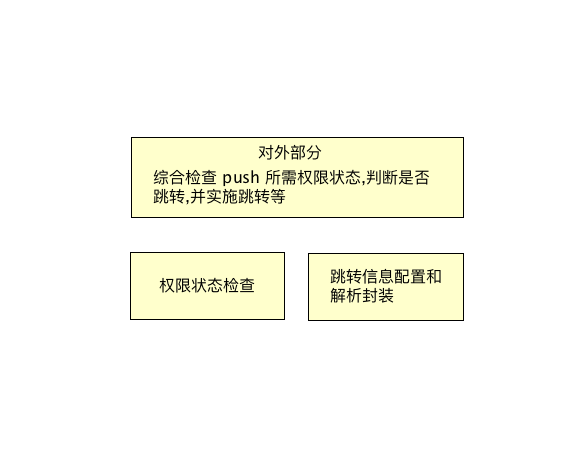
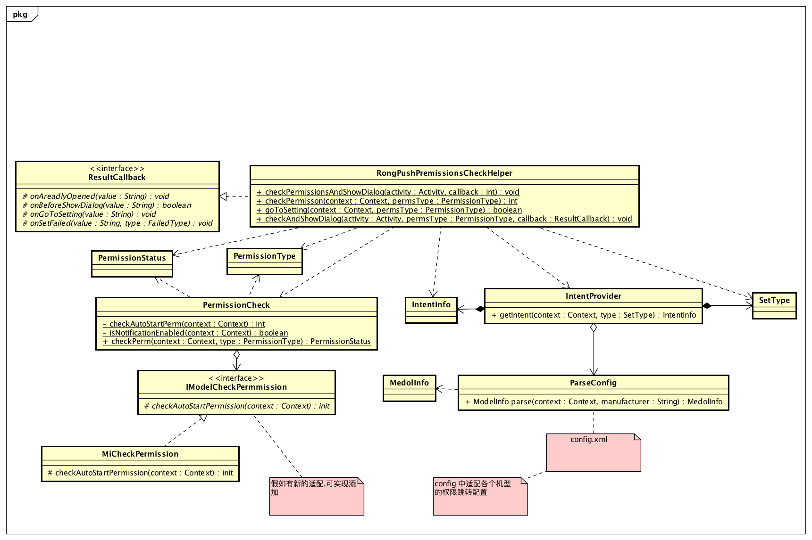

# android-push-settings-advisor
安卓手机推送设置指导。
## 简介
纵览国内安卓大环境，各大手机厂商为了限制应用后台行为，都加入了自己的权限控制系统。如果想让应用在后台正常收到消息推送，不同手机需要用户开启的权限也各不相同。为了解决以上问题，应用一般会在启动时引导用户进行权限配置，然而对各手机进行差异化配置是个特别琐碎且庞大的任务。为了节约各应用的开发成本，本着开源共享的精神，我们抽象出了该推送设置权限引导组件。

- **组件功能：**
	-  检测推送所需的权限状态。
	-  弹出提示需要设置权限的提示窗口。
	-  跳转对应权限的设置界面（针对不同的机型，做了不同的跳转界面的适配）

## 特别注意

-  由于有些手机开启自启动权限后，是通过系统的广播拉起应用。 但是由于 android 系统 API 26 及以上版本对隐式广播做了限制，导致可能收不到系统广播的问题。 则建议 target 版本最好设置 26 以下。


## 使用方法
- 导入此 Module 组件，然后在主工程的 Gradle 配置文件中添加 

``` xml
    api project(':pushpermission')
```


- 在代码中添加下面代码就可使用组件功能

```java
	 RongPushPremissionsCheckHelper.checkPermissionsAndShowDialog(Activity, new ResultCallback() {
            @Override
            public void onAreadlyOpened(String value) {
   
            }

            @Override
            public boolean onBeforeShowDialog(String value) {
               return false;
            }

            @Override
            public void onGoToSetting(String value) {
                
            }

            @Override
            public void onFailed(String value, FailedType type) {

            }
        });
```


**RongPushPremissionsCheckHelper** 类是主要的对外功能方法类。
 
**ResultCallback** 为回调接口， 可在 **onBeforeShowDialog** 方法中，在弹窗之前进行拦截操作。在此方法中可用于设置自己的弹窗机制。

具体的方法介绍可参考 **doc** 文件夹中的 [**API 文档**](./doc/index.html) 。

## 组件介绍
### 权限
组件中对三种权限进行检测并提示跳转。

- 自启动权限
	开启此权限后，部分手机则能收到系统广播通知（如，开机启动广播，解锁广播，电源插拔广播等）。可使用这些广播通知进行拉活。
- 通知显示权限
	开启此权限，可显示通知提示。 大多手机会自动开启， 少数手机需要自己手动设置。
- 保持应用权限
	即为手机上的锁屏存活，保持应用后台运行等权限。开启此权限可在一定程度能延长进程在后台的存活时间。 

### 架构组成

主要分为三部分：



- 检查权限状态
	- 目前通知权限可以检查
	- 自启动权限，小米手机可以检查。如果以后其他手机支持查询了，可进行扩展
- 权限设置页面跳转 Intent
	- 配置信息主要在 **config.xml** 文件中进行适配。
	
	```
	
		此配置文件是为了配置机型进行保活所需权限的权限设置界面的跳转信息配置。
		由于手机系统对保活的限制，需要开启某些特定的权限，并且某些手机所需的权限不一致。
	    所以在此页面进行配置以起到灵活适配的目的。
	    具体的信息配置规则如下，以小米为例：
	    <XIAOMI>
	        <AutoStart>
	            <IntentInfo>
	                <Package></Package>
	                <Clazz></Clazz>
	                <Action></Action>
	                <Data>
	                    <Key></Key>
	                    <Value></Value>
	                </Data>
	                 <Extra>
	                    <Key></Key>
	                    <Value></Value>
	                </Extra>
	                <SetPath></SetPath>
	            </IntentInfo>
	        </AutoStart>
	        <Notification> ... </Notification>
	        <Clean> ... </Clean>
	    </XIAOMI>
	
	    标签 XIAOMI ： 为手机的 Build.MANUFACTURER 字段的值。 当前为小米手机的 MANUFACTURER 值 （不区分大小写）。 不可为其他的，
	                   否则找到不到设置的机型。
	    标签 AutoStart ： 为自启动权限的配置。
	    标签 Notification ： 为通知权限的配置。
	    标签 Clean ： 为锁屏清理权限的配置。
	
	    后续如果需要添加别的权限跳转设置， 则会增加其他标签。
	
	    标签 IntentInfo : 为跳转中所要用到的的信息。 其中包括 package ， class， action 跳转中所需要的值。
	    标签 Data: intent 跳转所需的 data 数据。 有 Key 和 Value.  当 Value 值为 auto 的时候，则有代码内部自动获取值。
	    标签 Extra: intent 跳转所需的 Extra 数据。有 Key 和 Value.  当 Value 值为 auto 的时候，则有代码内部自动获取值。
	    标签 SetPath: 设置的界面路径
	
	    每个权限标签下可配置多个 IntentInfo。 这是为了兼容机型（因为有可能有的机型有，有的机型没有）。代码会全部解析出来，
	    并去检测配置的组件信息是否存在。如果存在则会直接使用当前的。后面的则不会再去验证。 如果没有再会再尝试下面的配置，
	    直到结束。所以，当有多个 IntentInfo 的时候， 建议把配置多的，优先的配置到前面，以提高检测效率。

	```
	
	
	- 然后有 ParseConfig 类进行解析封装成 ModelInfo。 在 IntentProvider 会根据配置每组权限的 Intent 信息查看此组件是否存在，如果不存在则继续检查下一下， 如果存在则会直接把当前的返回。
	
- 对外使用部分
	- 包括权限状态检查， 使用询问用户跳转设置和实施跳转权限设置页面部分逻辑


###  类图




## 加入我们

由于 Android 机型重多，希望更多的人加入我们，一起完善此组件， 适配组件尚未适配的机型。 

具体的适配方法， 即在 config.xml 文件中按照规则配置即可。

您也可进行留言，为我们提供您宝贵的建议。


